# Componentes do projeto

Listagem dos componentes divididos por globais (utilizados em mais de uma página)
e componentes locais (específicos de uma página)

## 1. Componentes Globais

1.0 Logo

1.1 Header

1.2 Footer

1.3 SectionHeader (Títulos de seções como: "Ver todos")

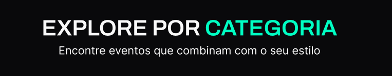

1.4 Links (Navegação)

1.5 Button (Componente de botão principal)

1.5.2 ButtonIcon (Botão de ícone)

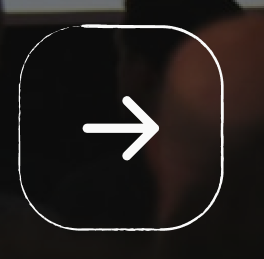
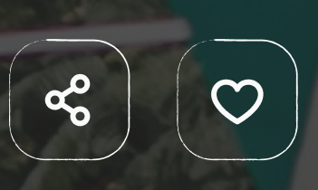

1.6 CardEvent (Card principal)

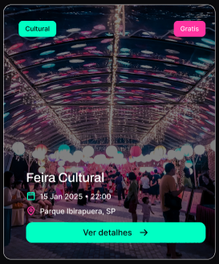

1.7 ButtonCategory (Card de categorias)

1.8 InputField (input de text)

1.9 SelectField (input de select)

## 2. Componentes Locais

### 📄 Landing Page

HeroSection (Banner principal)

StatItem (Contadores de eventos e usuários)

CardCategory (Cards de categorias)

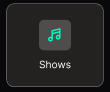

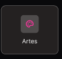

NewsletterBox (Seção de inscrição do email)

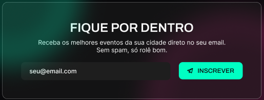

### 📄 Event List

FilterBar (Input de busca e botões de filtro)

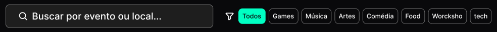

ListEvents (Listagem dos cards de Eventos)

### 📄 About Event

EventHeader (Bloco com título, data, hora e local do evento)

IconInfoBlock (Sub-componente para ícone + texto de info)

EventDescription ("Sobre o evento")

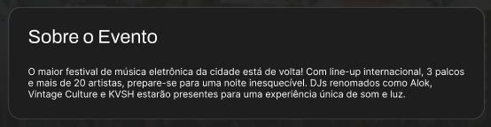

EventOrganizer (Mini card sobre o organizador)

Sidebar (Coluna lateral com preço e botão de compra)

### 📄 2.4 Create Event

2.4.1 FormContainer (Container cinza de agrupamento por tema)

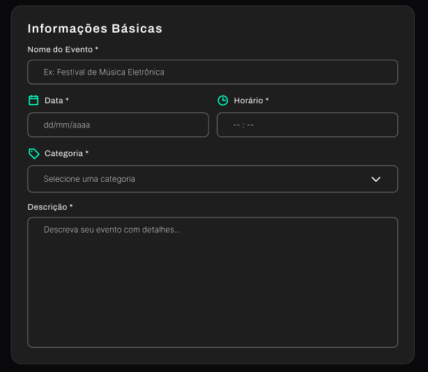

2.4.2 InputGroup (Label + input)

2.4.3 TagInput (Input de tags)

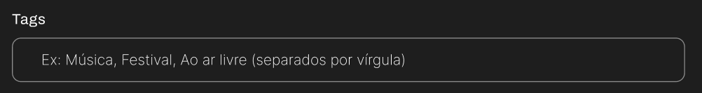

2.4.4 FormActions (Área dos botões de Cancelar/Publicar)

